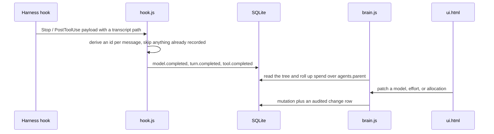

# brain-platform Low-Level Design

Owned by the brain-platform EM. Describes the code as it is, not as it might be. This service has no HLD by decision D-4: two services, no public API, and one deployable artifact do not justify one, so this file is the whole design record.

Keep it in sync with the code. The task that changes a module boundary, the event contract, an exit code, or the schema updates this file in the same PR.

## What this service is

The control plane and the build pipeline. One SQLite database holding every piece of mutable runtime state, a CLI over it, a local UI, hooks that capture real token and cost figures from harness transcripts, and the scripts that turn the sources into per-tool output.

The constraint every decision bends around: **it runs in any injected repository with nothing installed.** Not a hosted service, not a terminal runtime, not a provider quota reader, not a task board. Those are Herdr, quota-axi, Langfuse, and the tracker; the reasoning is in `references/agent-observability.md`.

## Stack, and why it diverges

Plain Node JavaScript on built-ins only, one HTML page, SQLite via `node:sqlite`. The brain enforces Node with TypeScript and React with TypeScript on the projects it is injected into and does not follow that itself, which is sanctioned by D-2, not a gap. No compile step means what is written is what is injected; a bundler in every consuming repository would cost more than React returns for a read-only dashboard. Types are welcome later behind the same output shape and are never a blocker.

## Module boundaries

| Module | Responsibility | Not its job |
|---|---|---|
| `schema.sql` | tables, indexes, and the partial unique index enforcing one live CEO | queries |
| `db.js` | open and migrate, config, the audit record, the subtree spend query and its input basis | commands |
| `state.js` | the read side: agent tree, path conflicts, budget roll-up, combined status | mutation |
| `brain.js` | the command surface and every mutation | reads it does not own |
| `emit.js` | event validation and ingestion, shared with hooks | deciding what to emit |
| `hook.js` | turning harness facts into events, idempotently | judging them |
| `quota.js`, `control.js` | adapters to quota-axi and Herdr | routing or control policy |
| `server.js`, `ui.html` | the local UI and its JSON API | anything the CLI cannot also do |
| `scripts/brain/` | validate, select, build, inject, import | the content being built |

`brain.js` and `server.js` both depend on `state.js` and neither on the other. That is load-bearing: an earlier version had `server.js` require `brain.js`, which exported after `main()` ran, so the server saw an empty module.

## Contracts other things depend on

| Contract | Consumed by | Where it is defined |
|---|---|---|
| Event schema, metadata only, with no content field | hooks, the CLI, any future exporter | `event.schema.json` |
| The CLI argument surface | personas, skills, the entry command | `control-plane/README.md` |
| Exit codes: 3 role taken, 4 allocation exceeds grantor | scripts and CI | `brain.js` |
| Target definitions | the build | `scripts/brain/lib/targets.js` |
| Placeholders substituted at build time | `brain-org` artifacts | `scripts/brain/build.js` |

A change to any of these is not a small change, whatever its line count.

## How usage arrives

Ids are deterministic (`msg:<uuid>`, `turn:<uuid>`), so a replayed transcript, an appended one, or a hook firing twice adds nothing. Verified by test: 40 events on the first run, 0 on the second.

## Decisions taken, and what was rejected

| Decision | Options | Choice | Why | Reversible |
|---|---|---|---|---|
| Store | markdown; JSONL; SQLite; a hosted control plane | SQLite via `node:sqlite` | Queryable, transactional, editable at runtime, zero-install | yes, at the cost of the roll-up query |
| Language | plain JavaScript; TypeScript compiled; TypeScript shipped as source | plain JavaScript (D-2) | No compile step and no dependency to build one. Shipping TypeScript source would force a toolchain on every consumer | yes |
| UI | a framework with dependencies; one HTML file; React bundled | one HTML file (D-2) | A read-only dashboard with a few audited inputs does not earn a bundler in every consuming repository | yes |
| Usage source | ask agents to self-report; read the transcript | read the transcript | Self-reporting was the thing that never happened | yes |
| Idempotency | a cursor; deterministic ids | deterministic ids | Survives replays, appends, and a double-fired hook | yes |
| Input basis under caching | fresh only; billable only; configurable | configurable, default `new` | Fresh alone never binds, billable alone exhausts instantly; every component stays visible either way | yes |

## What must keep holding

| Path | Target |
|---|---|
| `brain.js context` in a fresh repository | succeeds with no setup beyond Node |
| Usage ingestion | never double-counts; verified by test |
| CEO lock | a second live claim for the CEO role is always refused with exit 3, and no other role is blocked |
| Build | all six targets with no unresolved placeholder |
| Product build | never references a self-only skill or persona; the leak check runs both directions |

## Testing

Unit tests alone missed a bug once: a call-site rewrite corrupted SQL in the injected copy only, and the unit tests passed because they exercised modules directly. So the suite runs the CLI as a subprocess too, and CI injects into a scratch directory and exercises `context`, `status`, and `budget` with nothing installed.

## Left to the implementer

Query shapes, CLI output formatting, UI layout. This file fixes the module boundaries, the contracts, the exit codes, and the invariants above.

## Open questions

- Per-subagent attribution: a sidechain turn is currently attributed to the session's agent, because the hook cannot know the child's registered id. Worth pursuing or not.
- Whether an OTLP exporter belongs here or in a separate adapter.
- Whether `schema_version` needs a migration path before the first external user.
