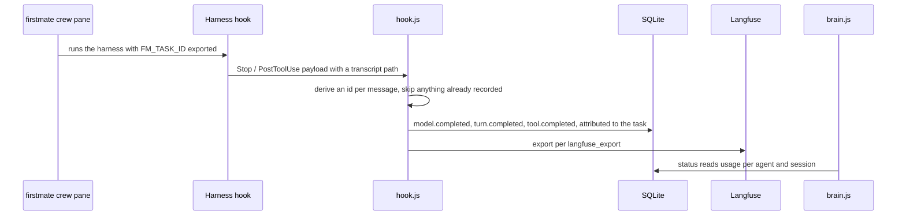

# brain-platform Low-Level Design

Owned by the brain-platform EM. Describes the code as it is, not as it might be. This service has no HLD by decision D-4: two services, no public API, and one deployable artifact do not justify one, so this file is the whole design record.

Keep it in sync with the code. The task that changes a module boundary, the event contract, an exit code, or the schema updates this file in the same PR.

## What this service is

The control plane and the build pipeline. One SQLite database of recorded agent-work usage, a CLI over it, hooks that capture real token and cost figures from harness transcripts, a Langfuse exporter, and the scripts that turn the sources into per-tool output.

The constraint every decision bends around: **it runs in any injected repository with nothing installed.** Not a hosted service, not a terminal runtime, not a fleet view, not a provider quota reader, not a task board. Those are firstmate with herdr, quota-axi, Langfuse, and the tracker; the reasoning is in `references/agent-observability.md`. Since D-5, spawning roles, choosing their model and effort, and tracking who is running are firstmate's alone.

## Stack, and why it diverges

Plain Node JavaScript on built-ins only, SQLite via `node:sqlite`. The brain enforces Node with TypeScript and React with TypeScript on the projects it is injected into and does not follow that itself, which is sanctioned by D-2, not a gap. No compile step means what is written is what is injected. Types are welcome later behind the same output shape and are never a blocker.

## Module boundaries

| Module | Responsibility | Not its job |
|---|---|---|
| `schema.sql` | the events, exports, config, and meta tables | queries |
| `db.js` | open and migrate, config, the per-agent usage summary and its input basis | commands |
| `brain.js` | the command surface: `status`, `event`, `export`, `config`, and a pointer for commands that moved to firstmate | crew state, which is firstmate's |
| `emit.js` | event validation and ingestion, shared with hooks | deciding what to emit |
| `hook.js` | turning harness facts into events, idempotently, and attributing them | judging them |
| `langfuse.js` | the Langfuse OTLP adapter, building each agent's trace from its own events | deciding what an agent is |
| `scripts/brain/` | validate, select, build, inject, import | the content being built |

`brain.js` and `hook.js` both depend on `db.js`, `emit.js`, and `langfuse.js`, and neither depends on the other.

## Contracts other things depend on

| Contract | Consumed by | Where it is defined |
|---|---|---|
| Event schema, metadata only, with no content field | hooks, the CLI, the exporter | `event.schema.json` |
| The CLI argument surface | the persona command template, `delivery-status` | `control-plane/README.md` |
| Exit codes: 2 usage error or a command that moved to firstmate, 5 export failed | scripts and CI | `brain.js` |
| Usage attribution order: `BRAIN_AGENT_ID`, then `FM_TASK_ID`, then `session-<8>` | the Langfuse export, `delivery-status` | `hook.js` |
| Target definitions: always-on file, skills directory, commands, hooks, MCP; no subagent files | the build | `scripts/brain/lib/targets.js` |
| Placeholders substituted at build time | `brain-org` artifacts | `scripts/brain/build.js` |

A change to any of these is not a small change, whatever its line count.

## How usage arrives

Ids are deterministic (`msg:<uuid>`, `turn:<uuid>`), so a replayed transcript, an appended one, or a hook firing twice adds nothing. Verified by test: 120 events on the first run, 0 on the second.

## Decisions taken, and what was rejected

| Decision | Options | Choice | Why | Reversible |
|---|---|---|---|---|
| Store | markdown; JSONL; SQLite; a hosted control plane | SQLite via `node:sqlite` | Queryable, transactional, zero-install | yes |
| Language | plain JavaScript; TypeScript compiled; TypeScript shipped as source | plain JavaScript (D-2) | No compile step and no dependency to build one. Shipping TypeScript source would force a toolchain on every consumer | yes |
| Crew state | a session claim, agent registry, quota snapshot, and local UI here; firstmate's | firstmate's (D-5) | firstmate already spawns, supervises, dispatches by quota, and keeps durable per-task state. A second copy drifts, and nothing registered anyway | yes |
| Usage source | ask agents to self-report; read the transcript | read the transcript | Self-reporting was the thing that never happened | yes |
| Attribution | the harness session; a registry lookup; firstmate's task id | `FM_TASK_ID`, falling back to the session | It is exported into every crew pane, so tokens land on the task that spent them with no lookup | yes |
| Idempotency | a cursor; deterministic ids | deterministic ids | Survives replays, appends, and a double-fired hook | yes |
| Input basis under caching | fresh only; billable only; configurable | configurable, default `new` | Fresh alone understates, billable alone overwhelms; every component stays visible either way | yes |

## What must keep holding

| Path | Target |
|---|---|
| `brain.js status` in a fresh repository | succeeds with no setup beyond Node |
| Usage ingestion | never double-counts; verified by test |
| Attribution | a hook fired with `FM_TASK_ID` records usage against that task; verified by test |
| Build | all six targets with no unresolved placeholder and no persona subagent files |
| Product build | never references a self-only skill or persona; the leak check runs both directions |

## Testing

Unit tests alone missed a bug once: a call-site rewrite corrupted SQL in the injected copy only, and the unit tests passed because they exercised modules directly. So the suite runs the CLI and the hook as subprocesses too, and CI injects into a scratch directory and exercises `event`, `status`, and `export langfuse --dry-run` with nothing installed.

## Left to the implementer

Query shapes and CLI output formatting. This file fixes the module boundaries, the contracts, the exit codes, and the invariants above.

## Open questions

- Per-subagent attribution: a sidechain turn is attributed to the session's agent, because the hook cannot know the child. Roles no longer spawn subagents, so this only matters for delegation a harness does on its own.
- Whether firstmate should also export the role it dispatched, so a trace is named by role rather than by task id.
- Whether `schema_version` needs a migration path before the first external user.
