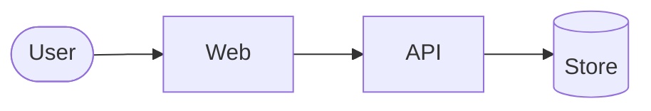

# Architecture

The whole system on one page: the shape, the stack, the features, and how each surface is put together. Anyone with a relevant skill may edit it. Contracts are not written here: use the SDK to get the types. Updated when a service or surface is added, removed, or changes responsibility. A surface or service with more to say keeps its own `ARCHITECTURE.md` in its folder's `docs/`; this page links it and holds only what the whole project needs.

## Project structure

```text
<monorepo layout: apps, services, packages, sdk at the root, infra>
```

## Tech stack

| Layer | Choice |
|---|---|
| Backend | |
| Web | |
| Mobile | |
| Database | |
| Infra | |
| Observability | |

## Features

One line each; detail in [PRD.md](PRD.md).

| Feature | Services | PRD |
|---|---|---|

## API reference

Swagger: `<link>`. Typed clients: `<sdk path at the repository root>`.

## Shape of the system



Services and the direction of dependence only.

## Backend

<modular monolith or separate deployables; how a service is structured inside; own doc: `backend/docs/ARCHITECTURE.md`, if any>

### Services

| Service | Bounded context | Owns | Client SDK | Docs |
|---|---|---|---|---|

### Shared modules

<the pluggable modules (payments, auth, profile, …): where each lives and how a service plugs one in>

### Infra

<what runs where per environment, how a service reaches its dependencies, where the infrastructure code lives>

### Data

<engine, where the schema lives, migration tooling, pooling>

### Observability

<what is emitted where; dashboards and alerts that exist>

## Web

<framework, language, build; own doc: `apps/web/docs/ARCHITECTURE.md`, if any>

### App structure

```text
<feature-first layout>
```

### Data layer

<the generated client SDK, client state, how mocks stand in for a contract the backend has not landed>

### Design system

<components, tokens, accessibility baseline>

### Verification

<how the client is tested end to end; what is automated and what is not yet>

## Mobile

<framework, language, build; own doc: `apps/mobile/docs/ARCHITECTURE.md`, if any>

### App structure

```text
<feature-first layout>
```

### Pluggable modules

<auth, notifications, force update, analytics: where each lives and its boundary>

### Data layer

<the generated client SDK, client state, offline and slow-network handling>

### Platform

<iOS and Android differences that matter; release and force-update flow>
