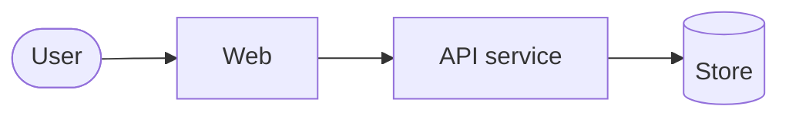

# Architecture

The whole system in one page. Owned by the **principal engineers**, who are scoped project-wide.

Its job is to let anyone, in any role, understand **what exists, what each part is for, and where a change belongs**, without reading code. The product manager plans from this page; an engineer starts here and then goes to their service's own documents for anything deeper.

**Keep it really high level.** Services and the direction they depend in, not classes, folders, or function signatures. If a section starts explaining how a service works inside, that belongs in that service's `HLD.md`, and this page keeps only the sentence that says what it is for.

Updated when a service is added, removed, renamed, or changes responsibility, and reviewed at every milestone close.

## Shape of the system

<Services and the direction of dependence. Nothing smaller than a service belongs in this diagram.>

## Services

One row per service. If a row wants a paragraph, the paragraph belongs in that service's documents.

| Service | Responsible for | Not responsible for | Owner (EM) | Docs |
|---|---|---|---|---|
| `<name>` | <the one thing it owns> | <the nearest thing people assume it owns> | <em> | `{{ORG_DIR}}/services/<name>/` |

## Surfaces

| Surface | Who uses it | Built with | Owner |
|---|---|---|---|
| Web | | | |
| Mobile | | | |
| Public API | | | |

## Contracts between services

Only the contracts that more than one service depends on. Everything else is internal.

| Contract | Produced by | Consumed by | Defined in |
|---|---|---|---|
| <name> | <service> | <services> | <OpenAPI path, schema, or event contract> |

## Where a change belongs

The routing table a product manager or engineer uses to name an owner without reading code.

| If the change is about... | It belongs to |
|---|---|
| <user-visible behaviour on the web> | <service> |
| <business rule or pricing> | <service> |
| <who can see what> | <service> |

## Cross-cutting decisions

Only the ones that change how work is planned. The full list lives in `DECISIONS.md`.

| Decision | Consequence for planning | Where it is recorded |
|---|---|---|
| <e.g. one shared identity service> | <every feature touching login needs that team> | `DECISIONS.md#D-n` |

## What is deliberately not here

Folder structure, class and function design, coding conventions, test strategy, schema detail, and the internals of any single service. Those live in each service's `HLD.md` and `LLD.md` and in `CONVENTIONS.md`. Putting them here would make this page something nobody reads.
